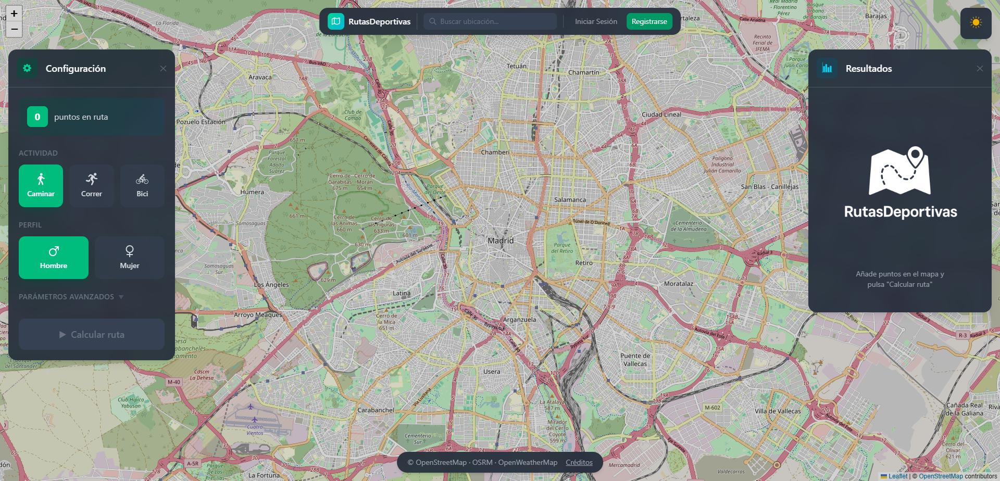

# Jesús González Gómez — Portfolio

> Portfolio personal Full-Stack Developer. Aplicación SPA moderna, rápida y responsive para presentar perfil, formación, stack tecnológico y proyectos destacados.

[](https://react.dev/)
[](https://vitejs.dev/)
[](https://tailwindcss.com/)
[](https://reactrouter.com/)
[](https://portfolio-stitch-rho.vercel.app/)
[](https://opensource.org/licenses/MIT)

**Demo en vivo:** https://portfolio-stitch-rho.vercel.app/ \
**Repositorio:** https://github.com/El-Jesule/portfolio-stitch

---

## 📑 Tabla de Contenidos

- [Demo](#-demo)
- [Sobre el Proyecto](#-sobre-el-proyecto)
- [Capturas](#-capturas)
- [Características](#-características)
- [Stack Tecnológico](#-stack-tecnológico)
- [Arquitectura y Estructura](#-arquitectura-y-estructura)
- [Sistema de Diseño](#-sistema-de-diseño)
- [Rutas y Páginas](#-rutas-y-páginas)
- [Proyectos Destacados](#-proyectos-destacados)
- [Instalación y Uso](#-instalación-y-uso)
- [Scripts Disponibles](#-scripts-disponibles)
- [Configuración](#-configuración)
- [Deployment](#-deployment)
- [Roadmap](#-roadmap)
- [Autor y Contacto](#-autor-y-contacto)
- [Licencia](#-licencia)

---

## 🌐 Demo

| Entorno | URL |
|---------|-----|
| **Producción (Vercel)** | [https://portfolio-stitch-rho.vercel.app/](https://portfolio-stitch-rho.vercel.app/) |
| **Repositorio GitHub** | [https://github.com/El-Jesule/portfolio-stitch](https://github.com/El-Jesule/portfolio-stitch) |

> Deploy automático desde `main` vía Vercel. Cada push dispara build y preview.

---

## 📖 Sobre el Proyecto

Portfolio desarrollado como carta de presentación profesional de **Jesús González Gómez — Full-Stack Developer**. El objetivo es centralizar en una única SPA toda la información relevante para reclutadores y colaboradores: perfil, formación, competencias, stack y casos de estudio de proyectos reales, con navegación fluida, diseño oscuro elegante y rendimiento optimizado.

Principios clave del proyecto:

*   **Performance first:** Vite 8 + React Compiler + Tailwind v4 (sin PostCSS extra)
*   **Código limpio y escalable:** Atomic Design, separación `data / components / pages / hooks`, datos mockeados como single source of truth
*   **UX cuidada:** Responsive mobile-first, transiciones suaves, estados de carga/éxito en formulario, navegación accesible
*   **Mantenibilidad:** Datos desacoplados en `src/data`, fácil añadir/editar proyectos, skills o formación sin tocar UI

---

## 🖼️ Capturas

> Las imágenes se sirven desde `/public/images`

| Hero / Home | Proyectos | Detalle de Proyecto |
|-------------|-----------|---------------------|
|  |  | Vista detalle con timeline, stack y features |

<details>
<summary>Ver más imágenes</summary>

- `public/images/projects/rutas-deportivas.png` — RutasDeportivas (mapa + panel resultados)
- `public/images/projects/okydoky.png` — OkyDoky (marketplace neón)
- `public/images/projects/habitafactoria.png` — HabitaFactoría (portal inmobiliario)

</details>

---

## ✨ Características

- **6 secciones + detalle dinámico:** Inicio, Sobre mí, Formación, Skills, Proyectos, Contacto y `/projects/:projectId`
- **Filtrado de proyectos:** Chips por categoría (`Todos`, `React`, `Node.js`, `Python`, `Tailwind`) con filtrado en memoria vía `useMemo`
- **Detalle de proyecto completo:** Hero, descripción, problema/solución, timeline, stack, features y galería
- **Formulario de contacto interactivo:** Hook personalizado `useContactForm` con estados `idle / typing / processing / 200 OK`, validación y feedback visual con `setTimeout` simulado
- **Diseño responsive:** Header con menú hamburguesa en mobile, grids adaptativos, imágenes optimizadas
- **Header sticky + navegación SPA:** `react-router-dom` `BrowserRouter` sin recarga
- **Footer con enlaces sociales:** GitHub, LinkedIn y Email centralizados en `constants/navigation.js`
- **Accesibilidad:** `aria-label`, `aria-expanded`, semántica HTML, `alt` descriptivos

---

## 🧰 Stack Tecnológico

### Core

| Tecnología | Versión | Uso |
|------------|---------|-----|
| **React** | `19.2.8` | Librería UI, componentes funcionales + hooks |
| **React DOM** | `19.2.8` | Render en navegador |
| **React Router DOM** | `7.18.3` | Routing SPA declarativo |
| **Vite** | `8.2.2` | Bundler y dev server ultrarrápido |
| **Tailwind CSS** | `4.3.3` | Framework utility-first (vía `@tailwindcss/vite`) |

### Tooling & DX

| Herramienta | Versión | Propósito |
|-------------|---------|-----------|
| `@vitejs/plugin-react` | `6.1.0` | Integración React + Vite (Oxc) |
| `@rolldown/plugin-babel` | `0.2.3` | Soporte Babel en Rolldown |
| `babel-plugin-react-compiler` | `1.0.0` | React Compiler — memoización automática |
| `ESLint` + `eslint-plugin-react-hooks` + `react-refresh` | `10.9.0` | Linting y reglas de hooks |
| `@tailwindcss/vite` | `4.3.3` | Plugin Tailwind sin config extra |

> **React Compiler** está habilitado en `vite.config.js` mediante `reactCompilerPreset()`. Mejora rendimiento evitando re-renders innecesarios, con leve coste en build.

### Requisitos

- **Node.js** `>= 18` (recomendado 20 LTS)
- **npm** `>= 9` / `yarn` / `pnpm`

---

## 🏗️ Arquitectura y Estructura

### Patrón: Atomic Design + Feature-based

```
src/
├── assets/                 # Recursos estáticos internos
├── components/
│   ├── atoms/              # Button, Badge, Icon, Input, Textarea
│   ├── molecules/          # ProjectCard, SkillBadge, TimelineItem, TechTag, FilterChip, NavLink, FormField, FeatureCard
│   ├── organisms/          # Header, Footer, HeroSection, FeaturedProjects, AboutSummary, AboutDetail, CompetencyGrid, SkillsGrid, ProjectsGrid, ProjectDetailContent, Timeline, ContactForm, CtaSection, LearningGrid
│   └── templates/
│       └── MainLayout/     # Layout base (Header + main 1200px + Footer)
├── pages/                  # HomePage, AboutPage, EducationPage, SkillsPage, ProjectsPage, ProjectDetailPage, ContactPage
├── data/                   # Single source of truth (mock)
│   ├── projects.js         # PROJECTS, PROJECT_DETAILS, PROJECT_CATEGORIES
│   ├── skills.js           # SKILL_CATEGORIES, FEATURED_TECH_STACK
│   ├── education.js        # EDUCATION_TIMELINE, CURRENT_LEARNING
│   └── about.js            # ABOUT_CONTENT, COMPETENCIES
├── constants/
│   └── navigation.js       # NAVIGATION_ITEMS, SOCIAL_LINKS, SITE_META
├── hooks/
│   └── useContactForm.js   # Lógica formulario (estado, focus, submit simulado)
├── styles/
│   └── globals.css         # Import Tailwind + Google Fonts + @theme tokens
├── App.jsx                 # Definición de rutas
└── main.jsx                # Entry + createRoot + StrictMode
```

**Puntos clave:**

- `App.jsx:1-27` — Centraliza `BrowserRouter` y `Routes`. Añadir nueva página = 1 import + 1 `<Route>`.
- `data/*.js` — Editar contenido sin tocar componentes. Ideal para CMS futuro.
- `components` — 100% desacoplados y reutilizables. Props tipadas implícitamente.
- `hooks/useContactForm.js:1-56` — Lógica aislada, fácil de testear o conectar a API real (EmailJS, Formspree, backend).

---

## 🎨 Sistema de Diseño

Definido en `src/styles/globals.css:5-29` vía `@theme`:

| Token | Valor | Uso |
|-------|-------|-----|
| `--color-background` | `#131316` | Fondo base |
| `--color-bg-canvas` | `#0a0a0c` | Canvas profundo (body) |
| `--color-primary` | `#c0c1ff` | Acento principal (títulos, links hover) |
| `--color-on-surface` | `#e4e1e5` | Texto primario |
| `--color-on-surface-variant` | `#c7c4d7` | Texto secundario |
| `--color-accent` | `#6366f1` | Botones / hover borders |
| `--color-surface-container` | `#1f1f22` | Cards / header |

**Tipografías:**

- `Geist` (`--font-display`) — Títulos, peso 400-700
- `Inter` (`--font-body`) — Cuerpo
- `JetBrains Mono` (`--font-code`) — Código / badges
- `Material Symbols Outlined` — Iconografía (`<Icon name="...">`)

**Estilo global:** `scroll-behavior: smooth`, scrollbar thin, fondo `#0a0a0c`, antialiasing.

---

## 🗺️ Rutas y Páginas

| Ruta | Componente | Descripción |
|------|------------|-------------|
| `/` | `HomePage` | `HeroSection` + `AboutSummary` + `FeaturedProjects` + `CtaSection` |
| `/about` | `AboutPage` | `AboutDetail` (foto + párrafos) + `CompetencyGrid` (4 competencias) |
| `/education` | `EducationPage` | `Timeline` (Bootcamp 2026 + DAW 2023-2025) + `LearningGrid` (AWS, Go, Redis, Microservicios) |
| `/skills` | `SkillsPage` | `SkillsGrid` (Frontend, Backend, Databases, Tools) |
| `/projects` | `ProjectsPage` | Grid filtrable + CTA contacto |
| `/projects/:projectId` | `ProjectDetailPage` | Contenido dinámico desde `PROJECT_DETAILS[id]` |
| `/contact` | `ContactPage` | `ContactForm` con `useContactForm` |

Navegación declarada en `src/constants/navigation.js:1-8` — cambiar orden/labels actualiza header y mobile menu automáticamente.

---

## 🚀 Proyectos Destacados

Datos en `src/data/projects.js:1-215`:

### 1. RutasDeportivas — `rutas-deportivas` (featured)
> App para planificar rutas sobre mapas interactivos. Calcula distancia, tiempo, calorías, pasos y desnivel. Auth, rutas guardadas y meteo en tiempo real.

- **Stack:** React, TypeScript, Node.js, Express, Prisma, Leaflet
- **Links:** [Live](https://rutas-deportivas.vercel.app/) · [GitHub](https://github.com/El-Jesule/RutasDeportivas)
- **TFG DAW** — Integración de mapas, geolocalización, elevación y meteo.

### 2. OkyDoky — `okydoky` (featured)
> Marketplace React con catálogo desde API externa, filtrado por categorías, usuarios y editorial. Tests incluidos.

- **Stack:** React 19, JavaScript, Vite, React Router, Axios, ESLint
- **Links:** [Live](https://tienda-online-okydoky.vercel.app/) · [GitHub](https://github.com/El-Jesule/tiendaOnlineOkyDoky)

### 3. HabitaFactoría — `habitafactoria` (featured)
> Portal alquiler estudiantes en España. Catálogo, fichas detalladas, agentes y formulario. Responsive + mini-app restaurante (TheMealDB).

- **Stack:** React 19, JavaScript, Vite, Tailwind CSS, React Router, Axios
- **Links:** [Live](https://habitafactoria.vercel.app/) · [GitHub](https://github.com/El-Jesule/La-Inmobiliaria)

Cada proyecto expone `PROJECT_DETAILS` con: `summary`, `descriptionParagraphs`, `problem`, `solution`, `timeline` (4 fases), `techStack`, `features` (10) y `gallery`.

---

## ⚙️ Instalación y Uso

### 1. Clonar

```bash
git clone https://github.com/El-Jesule/portfolio-stitch.git
cd portfolio-stitch
```

### 2. Instalar dependencias

```bash
npm install
# o
yarn install
# o
pnpm install
```

### 3. Desarrollo

```bash
npm run dev
```

Abre http://localhost:5173 — HMR activo.

### 4. Build producción

```bash
npm run build
# genera /dist
```

### 5. Preview producción local

```bash
npm run preview
```

### 6. Lint

```bash
npm run lint
```

Config en `eslint.config.js:1-21` (ignora `dist`, reglas `react-hooks` y `react-refresh`).

---

## 📜 Scripts Disponibles

| Script | Comando | Descripción |
|--------|---------|-------------|
| `dev` | `vite` | Servidor desarrollo con HMR |
| `build` | `vite build` | Build optimizado a `dist/` |
| `preview` | `vite preview` | Sirve `dist` localmente |
| `lint` | `eslint .` | Lint de `**/*.{js,jsx}` |

---

## 🔧 Configuración

### `vite.config.js:1-13`

```js
import react, { reactCompilerPreset } from '@vitejs/plugin-react'
import babel from '@rolldown/plugin-babel'
import tailwindcss from '@tailwindcss/vite'

export default defineConfig({
  plugins: [
    tailwindcss(),
    react(),
    babel({ presets: [reactCompilerPreset()] })
  ],
})
```

- `tailwindcss()` — Tailwind v4 sin `tailwind.config.js` necesario
- `react()` — JSX, Fast Refresh
- `babel({ presets: [reactCompilerPreset()] })` — React Compiler (experimental, mejora memoización automática)

### `index.html:1-13`

- `lang="en"`, `favicon.svg`, viewport responsive, entry `/src/main.jsx`

---

## ☁️ Deployment

**Vercel (actual):**

- Framework preset: **Vite**
- Build command: `npm run build`
- Output directory: `dist`
- Deploy automático en push a `main`

Para desplegar manualmente:

```bash
npm i -g vercel
vercel --prod
```

Alternativas: Netlify (`npm run build` + `dist`), GitHub Pages (requiere `base` en `vite.config.js`), Cloudflare Pages.

---

## 🛣️ Roadmap

- [ ] Conectar `ContactForm` a backend real (EmailJS / Resend / API FastAPI)
- [ ] Internacionalización (i18n: ES/EN)
- [ ] Tests unitarios (Vitest + Testing Library) para componentes y hooks
- [ ] Modo claro/oscuro con persistencia
- [ ] SEO mejorado (`react-helmet-async`, Open Graph, sitemap)
- [ ] Animaciones con `framer-motion` en Hero y Timeline
- [ ] Blog / sección artículos técnicos

---

## 👤 Autor y Contacto

**Jesús González Gómez — Full-Stack Developer**

- **Portfolio:** https://portfolio-stitch-rho.vercel.app/
- **GitHub:** https://github.com/El-Jesule
- **LinkedIn:** https://www.linkedin.com/in/jesús-gon-góm
- **Email:** [gonzalezgomezjesús16061997@gmail.com](mailto:gonzalezgomezjesús16061997@gmail.com)

> ¿Hablamos? Abierto a colaboraciones, oportunidades Full-Stack y proyectos freelance. [Contactar](https://portfolio-stitch-rho.vercel.app/contact)

---

## 📄 Licencia

Este proyecto es de código abierto bajo licencia **MIT**. Consulta el archivo `LICENSE` si lo añades.

---

<p align="center">
  Hecho con ❤️, React y mucho café por <a href="https://github.com/El-Jesule">Jesús</a> — 2026
</p>
